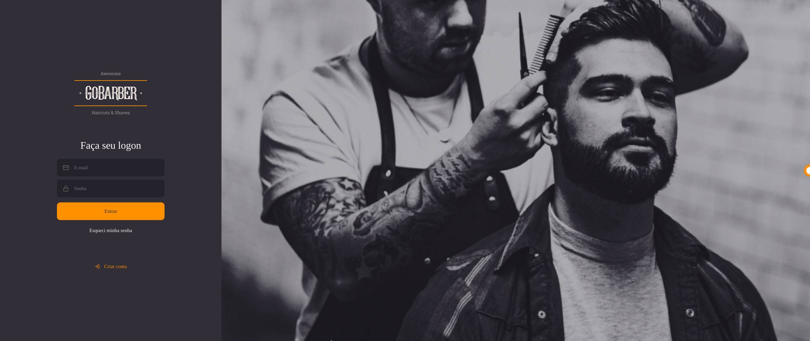

# Gobarber
## Aplicação de gerenciamento de barbearias, desenvolvida durante o bootcamp Gostack.

# Funcionalidades da aplicação em geral.

- Área de acesso.

- Área de registro.

- Área de criação de agendamentos em dias e horários especificos.

- Perfil de usuário com possibilidade de alteração de informações e o avatar.

